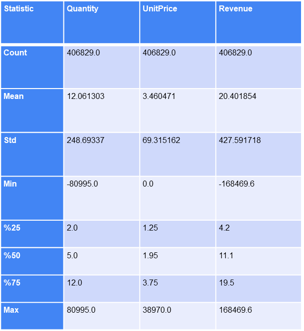

# CSE464 Term Project

## COMPUTER ENGINEERING DEPARTMENT  
### INTRODUCTION TO DATA SCIENCE & BIG DATA ANALYTICS  
**(AUTUMN SEMESTER 2024)**  

### Team Members:
- **Furkan Ersel** - *20200702055*  
- **Kerem Eren** - *20200702048*  
- **Abdurrahman Gündüzlü** - *20200702122*  

### Project Resources:
- [**Colab Link1**](https://colab.research.google.com/drive/1OCVkDRjw3oWlCWBUIvNz6OhDH9qtIuX3#scrollTo=7ojsSHsf-GjW)
- [**Colab Link2**](https://colab.research.google.com/drive/1oUXB9JRdj5Hej5ov1E97qeo0k3Y5J3pL?usp=sharing)
- [**Dataset**](https://archive.ics.uci.edu/dataset/352/online+retail)

---

## 1. Short Story of Business/Organization Challenge  
Retail Nexus, an e-commerce company based in the UK, had to struggle to maintain a competitive performance in the online retail market. The company faced several challenges, including:

- Underperforming products
- Fluctuations in seasonal sales
- Geographic imbalance in sales
- High product return rates

These issues created barriers to growth and customer satisfaction.

---

## 2. Problem Summary/Definition  
The major problems that Retail Nexus had to face included:

- **a.** Poor contributions from underperforming products.
- **b.** Missed opportunities in high-demand seasonal periods.
- **c.** Ineffective geographic and daily sales operations.
- **d.** High product return rates leading to financial losses.
- **e.** Poor marketing and resource allocation.

These issues led to missed revenue, lower customer satisfaction, and operational inefficiencies that hampered their competitive advantage.

  
  
  
  

---

## 3. Solution/Recommendations/Decisions  
Retail Nexus adopted data-driven approaches with advanced analytics, including:

- **a.** Using RFM analysis and K-Means clustering to segment customers, optimize marketing efforts, and improve customer engagement.
- **b.** Targeting high-value customers with loyalty programs and exclusive offers.
- **c.** Re-engaging low-value customers with personalized discounts and recommendations.
- **d.** Optimizing inventory and marketing based on historical sales and predictive insight.

These solutions resulted in:

- **8% revenue growth** within three months
- **20% reduction in marketing costs**
- **Improved customer satisfaction** and operational efficiency

  
  
  

As shown in the figure, the **R² score closest to 1** was obtained using the **random forest regression model**. This indicates that the model is the most suitable for our analysis.

When we calculate the **mean square error (MSE)** for each model, the **lowest error value** is observed in the random forest regression model. This confirms that the predictive values are closest to the actual values using this model.

---

## 4. Follow-Up & Evaluation Plan  
To maintain and enhance these results, Retail Nexus will:

- **a.** Regularly refresh predictive models and clustering strategies with updated data.
- **b.** Continuously monitor the performance of loyalty programs and marketing campaigns.
- **c.** Assess seasonal trends to refine inventory strategies.
- **d.** Gather and act on consumer feedback to enhance customer satisfaction and loyalty.
- **e.** Ensure data analytics and operational teams collaborate for market adaptability.

